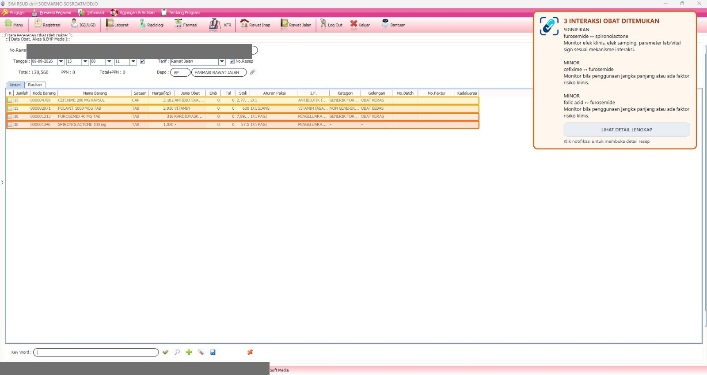
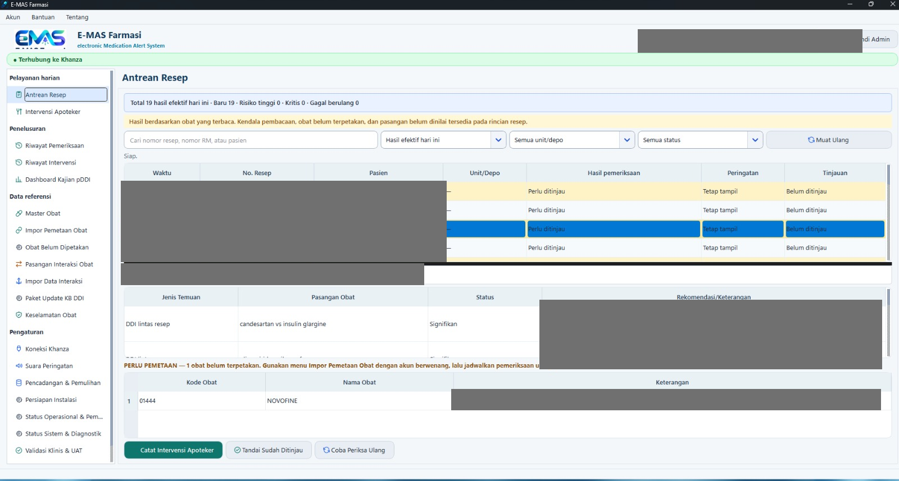
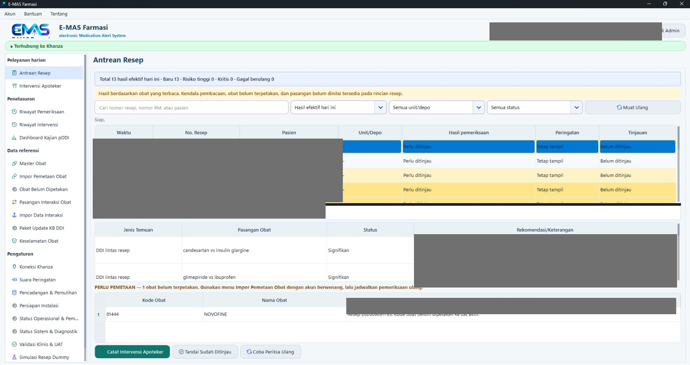
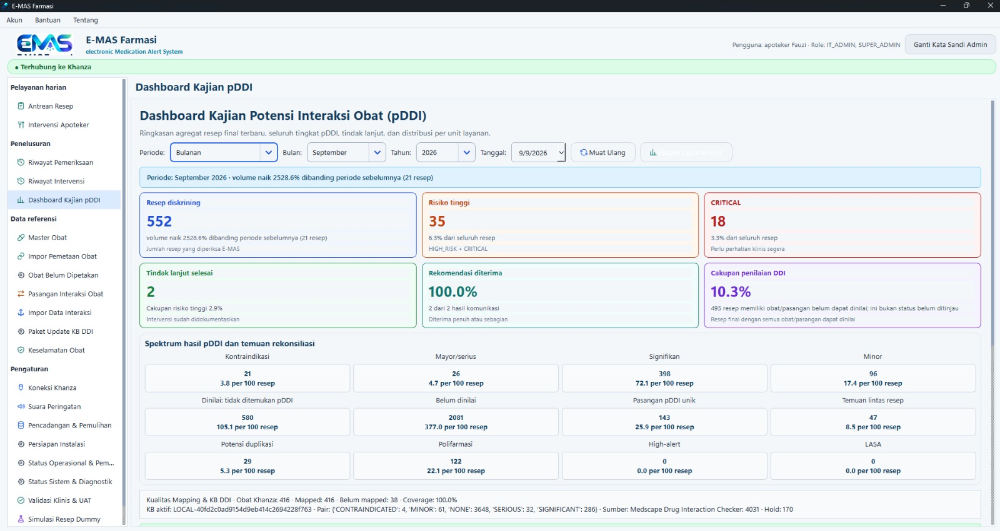

# E-MAS Farmasi

**Electronic Medication Alert System** adalah aplikasi desktop Windows untuk
membantu apoteker meninjau potensi *drug–drug interaction* (DDI) pada resep
SIMRS Khanza. Khanza tetap menjadi sistem informasi utama. E-MAS memberi hasil
skrining, informasi klinis, serta dukungan tindak lanjut farmasi tanpa mengubah
resep atau data pelayanan Khanza.

## E-MAS Farmasi v1.0.11

Release kandidat untuk pilot deployment E-MAS Farmasi dengan integrasi SIMRS
Khanza melalui Desktop/JAB. Khanza tetap menjadi sistem informasi utama;
E-MAS menyediakan skrining DDI dan dukungan kerja apoteker tanpa mengubah
resep maupun data pelayanan Khanza.

### Perbaikan utama

- First-run onboarding diperbarui.
- Pemilihan Farmasi Rawat Jalan / Rawat Inap saat commissioning.
- Desktop/JAB menjadi metode pembacaan resep default pada fresh install.
- JAB adapter aktif otomatis setelah commissioning.
- Auto-connect ketika SIMRS Khanza sudah berjalan.
- Status **Menunggu SIMRS Khanza dibuka** ketika Khanza belum dibuka.
- Penyederhanaan UI Mode Farmasi dan Antrean Resep.
- Backup dan Restore berbasis file untuk pemindahan data antar-PC.

### Integrasi

- Desktop/JAB: primary.
- MySQL/4 View: fallback.
- Satu prescription source aktif pada satu waktu.

### Catatan

Release ini sedang digunakan untuk pilot deployment pada workstation pelayanan
farmasi.

### Keamanan

E-MAS membaca SIMRS Khanza secara read-only dan tidak mengubah data Khanza.

## Bukti tampilan pilot

Gambar berikut telah disamarkan: nama pasien, nomor rekam medis, nomor resep,
nama pengguna, dan alamat jaringan tidak ditampilkan.



*Popup menampilkan jumlah interaksi, pasangan obat, tingkat keparahan, dan
tindakan klinis ringkas. Overlay warna adalah penanda tambahan pada baris obat
di Khanza setelah verifikasi workstation.*



*Antrean Resep menempatkan hasil skrining, pasangan DDI lintas resep, dan item
belum dipetakan dalam satu area kerja apoteker.*



*Tampilan Mode Farmasi yang dikompakkan memberi ruang lebih besar untuk tabel
antrean dan rincian interaksi pada layar pelayanan.*



*Dashboard Kajian pDDI menyajikan ringkasan agregat, spektrum tingkat risiko,
dan indikator kualitas mapping serta Knowledge Base DDI untuk pengguna
berwenang.*

## Fitur utama

- Pembacaan resep SIMRS Khanza melalui Desktop/Java Access Bridge (JAB) pada
  workstation yang sama.
- Skrining DDI berdasarkan Knowledge Base DDI Published/Active dengan
  provenance sumber tetap terpisah.
- Popup DDI agregat, audio peringatan, dan overlay penanda obat yang terpisah
  dari jalur evaluasi klinis.
- Antrean resep, detail hasil skrining, registry obat belum dipetakan, dan
  dokumentasi intervensi apoteker.
- Pengelolaan mapping obat, Knowledge Base DDI, backup/restore, pembaruan KB,
  dashboard kualitas, serta pemantauan operasional untuk peran berwenang.
## Prinsip penggunaan

- E-MAS **read-only** terhadap Khanza. Aplikasi tidak mengubah, menyimpan, atau
  menghapus resep, obat, pasien, maupun transaksi Khanza.
- Desktop/JAB membaca konteks resep yang sedang terbuka pada layar Khanza.
- DDI engine hanya memakai Knowledge Base DDI yang berstatus Published/Active.
  Draft tidak dipakai untuk skrining pelayanan.
- Obat yang belum mapped atau data yang belum lengkap tidak boleh dianggap aman.
- Popup dan audio tidak menunggu overlay, analitik, backup, atau proses
  administratif lain.
- E-MAS membantu proses farmasi; keputusan klinis tetap berada pada apoteker,
  KFT, dan kebijakan rumah sakit.

## Instalasi

Jalankan installer resmi Windows sebagai Administrator. Installer menempatkan
aplikasi dan runtime pada Program Files, sedangkan data operasional dipisahkan
agar tetap aman saat upgrade atau uninstall.

Data persisten berada di:

```text
C:\ProgramData\eMSSFarmasi\
├── Database\emss.db
├── Backups\
├── Exports\
├── Logs\
└── config.toml
```

Saat instalasi baru:

1. Jalankan E-MAS.
2. Buat **Admin Utama**.
3. E-MAS otomatis membuka **Persiapan Awal E-MAS**.
4. Pilih **Farmasi Rawat Jalan** atau **Farmasi Rawat Inap**.
5. Gunakan **Desktop / JAB** yang sudah dipilih secara default, kecuali rumah
   sakit secara eksplisit menggunakan MySQL / 4 View.
6. Selesaikan pemeriksaan sistem dan masuk ke E-MAS.
7. Jalankan **Persiapan Instalasi** dan UAT resep sebelum pelayanan.

Upgrade tidak mengganti database lokal, mapping, registry obat belum dipetakan,
Knowledge Base DDI, audit, backup, konfigurasi commissioning, atau profil
layanan yang sudah valid.

## Menggunakan Desktop / JAB tanpa database Khanza

Desktop/JAB adalah cara standar untuk memakai E-MAS pada PC farmasi saat ini.
Tidak diperlukan pembuatan view Khanza, akun database read-only, konfigurasi IP
server, maupun password database.

Prasyarat:

1. Khanza dan E-MAS berjalan pada komputer serta sesi Windows pengguna yang
   sama.
2. Metode pembacaan resep pada onboarding dipilih **Desktop / JAB**.
3. Khanza boleh dibuka sebelum atau sesudah E-MAS. Jika belum terbuka, status
   akan menampilkan **Menunggu SIMRS Khanza dibuka** dan tersambung otomatis
   saat Khanza tersedia.
4. Jika Khanza ditutup, Desktop/JAB tetap aktif dan akan menyambung kembali
   otomatis ketika Khanza dibuka lagi.

Konfigurasi utama pada `C:\ProgramData\eMSSFarmasi\config.toml`:

```toml
khanza_adapter = "desktop"
khanza_polling_enabled = true
khanza_internal_polling_consent = true
khanza_poll_interval_seconds = 1
khanza_stability_interval_seconds = 2.0
khanza_stability_max_attempts = 3
```

`KhanzaBridge.exe` sudah berada di paket aplikasi. Jangan mengarahkan
`khanza_desktop_bridge_path` ke executable UAT sementara atau ke folder hasil
build pengembangan.

### Alur kerja apoteker

1. Buka detail resep pada Khanza hingga daftar obat terlihat lengkap.
2. Tunggu E-MAS membaca resep hingga tampilan resep stabil.
3. E-MAS melakukan identifikasi resep, mapping obat, dan evaluasi DDI.
4. Bila ada DDI, popup agregat menampilkan jumlah interaksi, tingkat keparahan,
   pasangan obat, dan tindakan klinis ringkas.
5. Klik **Lihat Detail Lengkap** untuk melihat mekanisme, efek klinis,
   manajemen, sumber/provenance, dan informasi klinis lain yang tersedia.
6. Tinjau resep dan dokumentasikan intervensi sesuai kebijakan rumah sakit.

Hasil pemeriksaan dapat berupa:

| Status | Arti |
| --- | --- |
| DDI ditemukan | Ada pasangan interaksi yang perlu ditinjau. |
| Lengkap, tanpa DDI | Seluruh data dapat dinilai dan tidak ditemukan DDI pada KB aktif. |
| Partial / unmapped | Ada obat belum terpetakan atau knowledge belum cukup; hasil tidak boleh dianggap aman. |
| Gangguan teknis | Resep atau komponen yang diperlukan belum dapat dibaca secara valid. |

## Overlay penanda obat di Khanza

Overlay adalah penanda visual tambahan pada nama obat yang terlibat DDI.
Overlay tidak menggantikan popup dan audio.

Overlay baru boleh diaktifkan setelah UAT pada workstation membuktikan bahwa
baris yang ditandai benar pada skala Windows 100%, 125%, atau 150%. Konfigurasi
opt-in tersebut adalah:

```toml
khanza_desktop_overlay_poc = true
```

Jika ukuran tabel, koordinat layar, DPI, atau pembacaan Desktop/JAB tidak cukup
pasti, overlay akan disembunyikan untuk mencegah penandaan baris yang salah.
Skrining, popup, dan audio tetap berjalan.

## MySQL/MariaDB sebagai fallback

Integrasi MySQL/MariaDB tetap tersedia untuk lingkungan yang memang memerlukan
fallback tersebut. Jalur ini tidak dijalankan bersama Desktop/JAB.

```text
Desktop/JAB XOR MySQL
```

Untuk MySQL, rumah sakit harus memakai akun khusus read-only dengan hak `SELECT`
pada view integrasi yang disetujui. Password tidak boleh disimpan di
`config.toml`; gunakan Windows Machine Environment Variable
`EMSS_KHANZA_PASSWORD`.

Dokumen dan script yang relevan:

- [Kontrak view Khanza](docs/KHANZA_VIEW_CONTRACT_SPRINT_6.md)
- [Script view MariaDB](templates/khanza_integration_views_mariadb104.sql)
- [Contoh hak akses read-only](templates/khanza_readonly_grants.example.sql)

## Mapping obat dan Knowledge Base DDI

### Mapping obat

Obat Khanza dipetakan ke zat aktif kanonik sebelum evaluasi DDI. Bila obat baru
belum dipetakan, E-MAS memasukkannya ke **Obat Belum Dipetakan** agar dapat
ditinjau Admin/KFT. Mapping tidak dibuat otomatis dari kemiripan nama obat.

Obat mapped tidak otomatis berarti seluruh knowledge DDI sudah lengkap. E-MAS
menjaga kondisi ini sebagai partial/unmapped agar tidak menghasilkan false SAFE.

### Knowledge Base DDI

Knowledge Base memiliki lifecycle DRAFT, REVIEW/PENDING, PUBLISHED/ACTIVE, dan
HISTORICAL/RETIRED sesuai governance yang tersedia. Hanya satu versi Production
aktif pada satu waktu.

- Draft tidak memengaruhi skrining produksi.
- Publish dan rollback hanya untuk Admin/Super Admin sesuai RBAC.
- Provenance Medscape dan Drugs.com disimpan terpisah per rule.
- Perbedaan severity atau informasi antar-sumber menjadi conflict yang perlu
  review; sistem tidak melakukan overwrite diam-diam.
- Perubahan KB dicatat dalam audit dan hasil lama dapat diinvalidasi aman saat
  versi KB aktif berubah.

## Peran pengguna

| Peran | Kewenangan utama |
| --- | --- |
| Mode Farmasi / Apoteker | Membaca hasil skrining, antrean resep, dan dokumentasi intervensi sesuai hak akses. |
| KFT / Clinical Reviewer | Meninjau mapping dan knowledge sesuai kebijakan yang diberikan. |
| Admin / Super Admin | Mengelola konfigurasi, mapping, KB, publish/rollback, backup/restore, paket KB, serta pemulihan operasional. |

Publish, rollback, restore, pemasangan paket KB, dan recovery bridge dilindungi
otorisasi backend; menyembunyikan tombol saja tidak dianggap sebagai kontrol
akses.

## Status operasional dan pemulihan

Buka **Status Operasional & Pemulihan** untuk melihat:

- Database Lokal;
- Knowledge Base DDI aktif;
- konfigurasi layanan RALAN/RANAP;
- Prescription Source;
- Khanza/JAB dan KhanzaBridge;
- audio dan overlay.

Status menggunakan **Siap**, **Perlu Perhatian**, **Gangguan**, atau **Belum
Diverifikasi**. Admin dapat memakai **Periksa Ulang** atau **Coba Pulihkan
Bridge**. Recovery tidak me-restart Khanza, tidak mengubah database Khanza, dan
tidak boleh membuat bridge ganda.

## Backup, restore, dan pembaruan KB

Menu **Pencadangan & Pemulihan** tersedia untuk Admin/Super Admin. Gunakan
**Buat Backup** sebelum perubahan administratif besar. Backup diverifikasi
sebelum dinyatakan berhasil dan disimpan pada folder `Backups`.

Restore selalu memvalidasi paket dan menampilkan ringkasan sebelum overwrite.
Jika restore gagal, state lama dipertahankan sejauh arsitektur lokal
memungkinkan.

Paket update Knowledge Base menggunakan manifest, versi, checksum, dan
provenance. Sebelum pemasangan, E-MAS membuat backup otomatis. Paket rusak,
checksum salah, conflict, atau versi lama tidak boleh menimpa KB aktif secara
diam-diam.

## Privasi dan keamanan

- Jangan menyimpan password Khanza, secret, atau data pasien di konfigurasi
  yang dibagikan, source code, screenshot, atau log dukungan.
- E-MAS hanya menyimpan dan menampilkan data yang diperlukan untuk fungsi
  operasional dan audit setempat.
- Gunakan akun Khanza dengan hak minimal bila fallback MySQL dipakai.
- Jangan menempatkan database aktif E-MAS pada folder jaringan bersama.
- Backup dan media paket KB harus dikelola mengikuti kebijakan keamanan rumah
  sakit.

## Dokumentasi tambahan

- [Panduan impor mapping obat](docs/DRUG_MAPPING_IMPORT_GUIDE.md)
- [Panduan Knowledge Base DDI](docs/DDI_KNOWLEDGE_BASE_GUIDE.md)
- [Panduan backup dan restore](docs/BACKUP_RESTORE_SPRINT_9.md)
- [Checklist UAT installer](PHASE_3_6_INSTALLER_UAT_CHECKLIST.md)
- [Checklist UAT operational health](PHASE_3_5_OPERATIONAL_HEALTH_UAT_CHECKLIST.md)

## Batasan klinis

E-MAS adalah alat pendukung keputusan. Hasil skrining harus ditinjau bersama
kondisi pasien, indikasi, dosis, fungsi organ, riwayat terapi, dan pedoman
rumah sakit yang berlaku. Aplikasi tidak boleh digunakan sebagai pengganti
penilaian profesional apoteker atau dokter.
